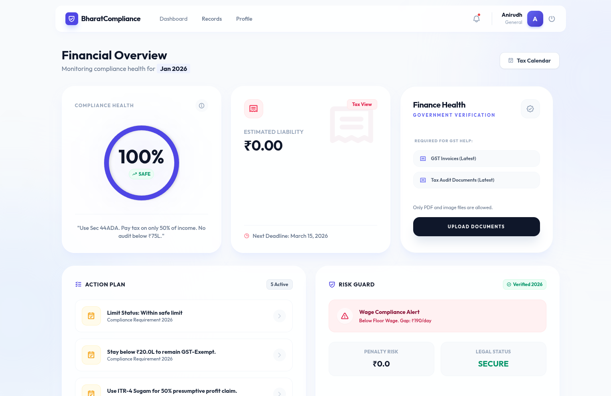
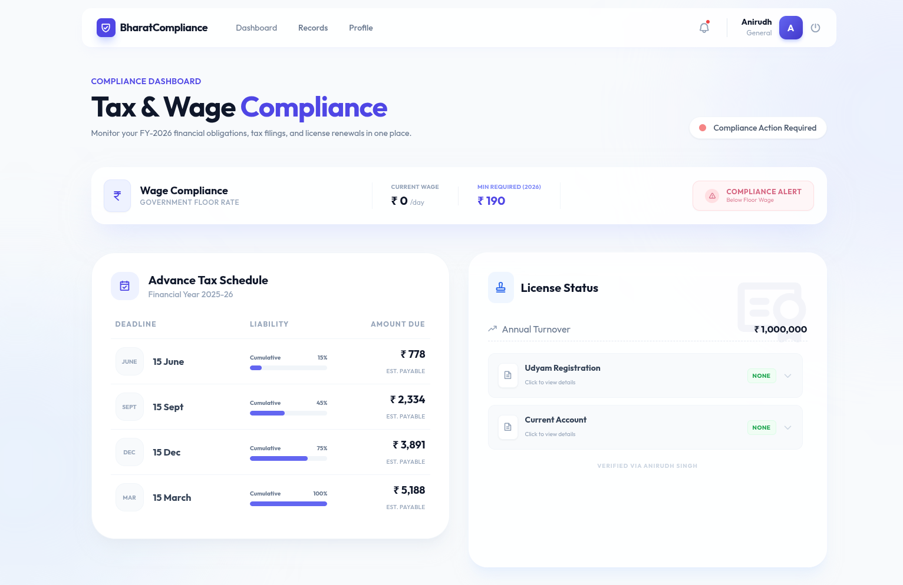
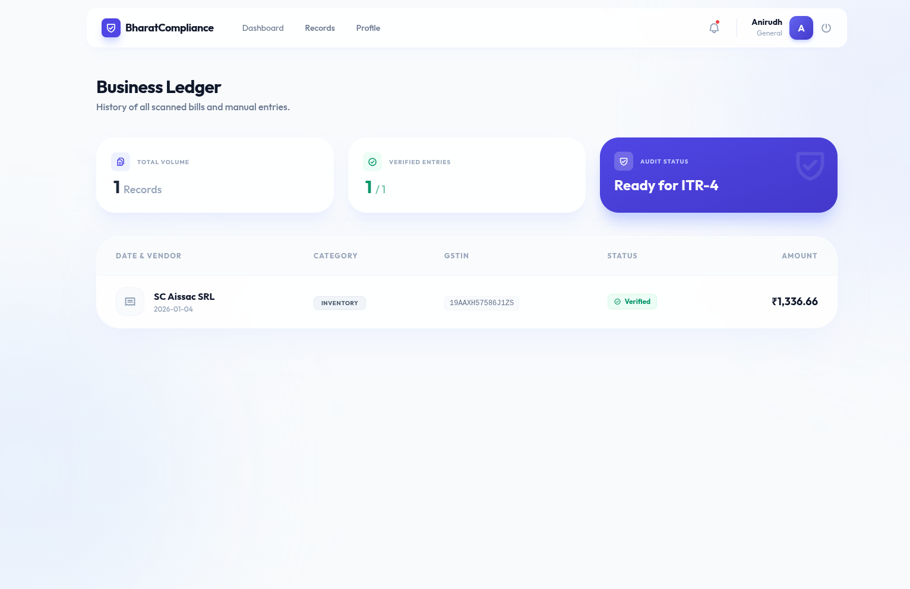

### PROBLEM STATEMENT : PS 15 : Real-Time Tax & Compliance Copilot for Micro-Businesses
### PROJECT NAME      : BharatCompliance
### TEAM NAME         : TEAM ZERO
### DEPLOYED LINK     : [Website Demo](https://bharatcomplianceb.onrender.com)
### VIDEO LINK        : [Insert Link Here]
### PPT LINK          : [Presentation PPTX](https://docs.google.com/presentation/d/1KDWhQYRk_OeN82xKNREEAgIfyb_jCLLw/edit?usp=sharing&ouid=105976556751002261039&rtpof=true&sd=true)

---

# BharatCompliance

## Project Overview
**BharatCompliance** is an AI-powered financial assistant designed specifically for India's micro-businesses (Street Vendors, Gig Workers, Freelancers). It bridges the gap between complex government regulations and daily business operations by providing real-time compliance monitoring.

Unlike standard accounting software, our solution uses **Gemini Vision AI** to automate data entry from physical bills and provides predictive alerts for GST thresholds, FSSAI renewals, and Advance Tax deadlines.

### Key Features
* **AI-Powered OCR:** Instantly extracts transaction details from images of rough bills or invoices.
* **Real-Time Compliance Score:** A dynamic 0-100 score that changes based on your turnover and filing status.
* **Sector-Specific Logic:** tailored compliance checklists for specific sectors (e.g., FSSAI for food, Welfare Fund for gig workers).
* **Predictive Threshold Alerts:** Warns users before they cross critical GST turnover limits (20L/40L).
* **Automated Tax Calendar:** visualizing upcoming liabilities and deadlines in a clear, timeline view.

---

## Setup & Installation Instructions

### Prerequisites
* Python 3.9+
* Google Gemini API Key

### Installation Steps

1.  **Clone the Repository**
    ```bash
    git clone https://github.com/ByteQuest-2025/GFGBQ-Team-teamzero.git
    cd GFGBQ-Team-teamzero
    ```

2.  **Create & Activate Virtual Environment**
    ```bash
    # Windows
    python -m venv venv
    venv\Scripts\activate

    # macOS/Linux
    python3 -m venv venv
    source venv/bin/activate
    ```

3.  **Install Dependencies**
    ```bash
    pip install -r requirements.txt
    ```

4.  **Environment Variables**
    Create a `.env` file in the root directory:
    ```env
    GOOGLE_API_KEY=your_gemini_api_key_here
    SECRET_KEY=your_random_secret_key
    ```

5.  **Run the Application**
    ```bash
    cd web
    python app.py
    ```
    The app will run at `http://127.0.0.1:5000`

---

## Usage Instructions

1.  **Onboarding:** Select your specific business category (e.g., "Street Food Vendor").
2.  **Digitize Records:** Upload an image of a bill/receipt. The AI will auto-fill the amount, date, and vendor details.
3.  **Monitor Health:** Check the Dashboard for your current "Compliance Score" and "Turnover Thermometer."
4.  **Act on Alerts:** Follow the "Action Required" items in the Compliance Checklist (e.g., "Renew FSSAI License").

---

## Relevant Screenshots

### 1. Dashboard & Compliance Health


### 2. AI Document Scanner


### 3. Tax Calendar & License Status



---

## Team
- **Anirudh Singh**
- **Aditya Valand**
- **Shantanu Sahu**
- **Alok Ranjan**
